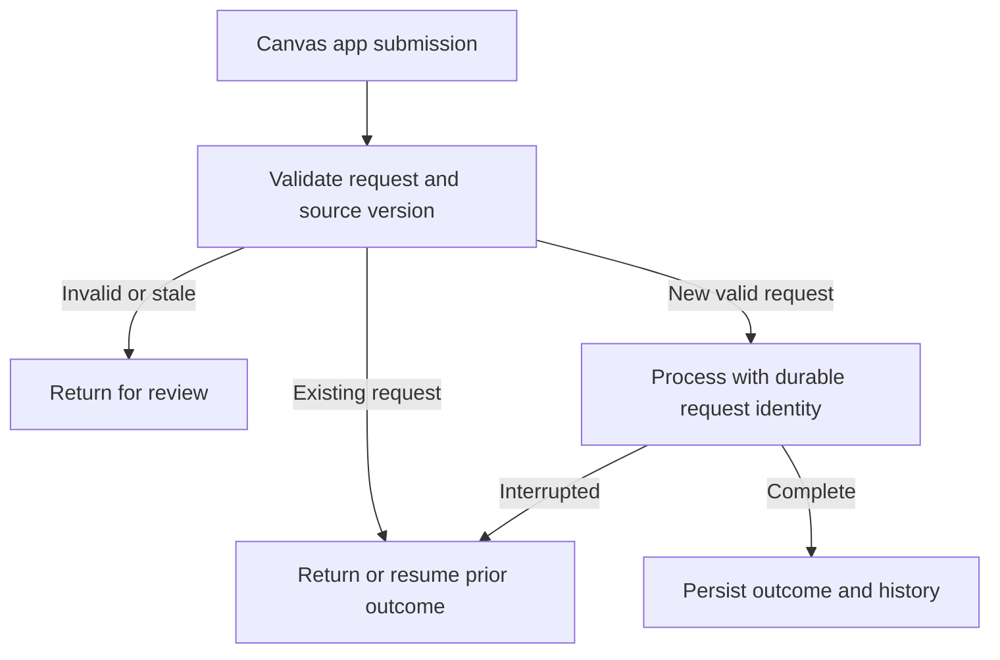

# Prime Power Platform Lab

### A settlement exception-review workflow for Power Apps, Dataverse and Power Automate

The goal is to let a reviewer inspect an exception, record a reasoned decision and later see a durable processing outcome. The design addresses repeated submissions, stale records and interrupted processing—the situations that can make a simple approval form unreliable.

**Implementation in progress · Power Automate Save blocked · Design and reported build evidence**

[Project overview](docs/PROJECT_OVERVIEW.md) · [Data model](docs/DATA_MODEL.md) · [Build status](BUILD_STATUS.md) · [Latest Hermes checkpoint](evidence/HERMES_CHECKPOINT_20260928.md) · [Acceptance scenarios](tests/ACCEPTANCE.md)

## The business problem

A settlement issue needs more than a corrected-looking number on a screen. The reviewer needs the original value, its source, a reason for the decision and a clear distinction between submission and successful processing. Multiple submissions of the same request should not create repeated effects, and older decisions should not silently overwrite newer source information.

Chris Sheppard supplies the owner-operator requirements and business rules. Hermes assists with the Microsoft implementation; Codex prepared this repository's documentation. This is an independent portfolio project, not an official Prime product.

## Intended workflow

*Proposed workflow, not a diagram of a verified deployed flow. Actual source and runtime evidence are still to be added.*

| Component | Intended responsibility | Evidence currently in this repository |
|---|---|---|
| Power Apps Canvas app | Review queue, source detail and decision form | Requirements and a recorded user-reported checkpoint |
| Dataverse | Review items, decisions and durable processing records | [Proposed entity model](docs/DATA_MODEL.md) |
| Power Automate | Validation, processing, retry handling and outcome updates | [Reported Save blocker](evidence/HERMES_CHECKPOINT_20260928.md); actual flow definition and successful run pending |
| Evidence and reproduction | Show what ran and how to import it | [Evidence requirements](evidence/README.md) and [export instructions](exports/README.md) |

## What is established so far

The user-supplied Hermes screenshot from September 28, 2026 reports that the app compiled and was published, invalid input created no decision, and a repeated valid request reused an existing decision. The visible decision remained **Submitted**.

The latest supplied Hermes report says native-designer Save still fails with **`FlowNotOriginalAuthor`** after connection warnings were repaired. Read-only metadata reportedly identifies the current maker as creator and owner, but the underlying cause remains unverified. Both flow drafts remain off, with no successful processor run established. A private support draft is prepared and unsent.

The [sanitized checkpoint](evidence/HERMES_CHECKPOINT_20260928.md) records the observations and evidence limits. This repository does not yet contain the actual solution export, Canvas source, flow definitions or independently verified runtime results. The next milestones are successful Save, a reviewed saved definition, synthetic processing tests and export/import reproduction.

## Design decisions worth inspecting

- A review item can have many intentional decisions; retrying one request must preserve its identity.
- Original values and prior decisions remain available after review.
- Customer codes remain text. City and state suffice for the first version; street addresses are optional.
- Different facilities remain distinct even when they share a company name.
- Fictional seed data supports demonstration without a write connection to the private financial ledger.

See the [project overview](docs/PROJECT_OVERVIEW.md) for the business rationale and completion criteria.

## Next build evidence

First resolve the reported Save blocker through supported administration or support. Preserve the existing app and inactive drafts. A successful Save must be observed before continuing to processor acceptance.

1. Add the actual solution export, unpacked source and fictional seed data.
2. Capture the queue, source detail, decision form and persisted processed outcome from the running app.
3. Record flow runs and storage results for valid, duplicate, stale and interrupted requests.
4. Import the exported solution into a suitable development environment and document the result.

Until those steps are evidenced, this repo supports a **workflow design / build-in-progress** discussion. It does not yet prove a completed Power Platform implementation.

## Continue the existing implementation

The active Linux workstation project is `~/Projects/prime-power-platform-lab`. Preserve Hermes's working files and history, and compare this documentation before merging. Supported Microsoft export/import tooling must supply the actual artifacts; these Markdown files are not a deployable solution.

| Path | Contents |
|---|---|
| [docs/](docs/) | Business overview and proposed data model |
| [tests/ACCEPTANCE.md](tests/ACCEPTANCE.md) | Expected observations and evidence for each runtime scenario |
| [src/](src/) / [exports/](exports/) | Instructions for adding actual source and solution exports |
| [evidence/](evidence/) | Evidence inventory requirements |
| [config/example.json](config/example.json) | Placeholder local configuration |

The working Linux SQL/dashboard demonstration and local Settlement Review Desk are in the separate [Prime Proof Lab](https://github.com/christopher-sheppard/prime-proof-lab-portfolio). Evidence from that application does not establish that this Microsoft workflow is complete.
